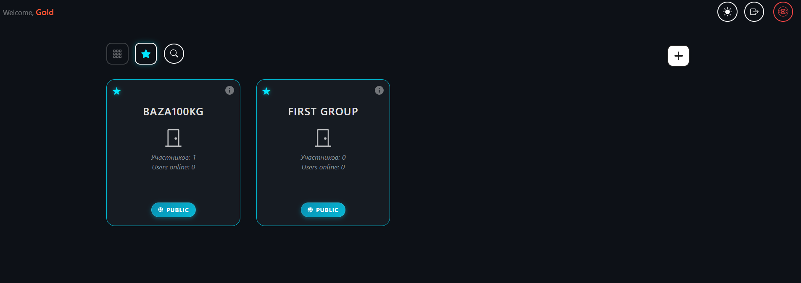
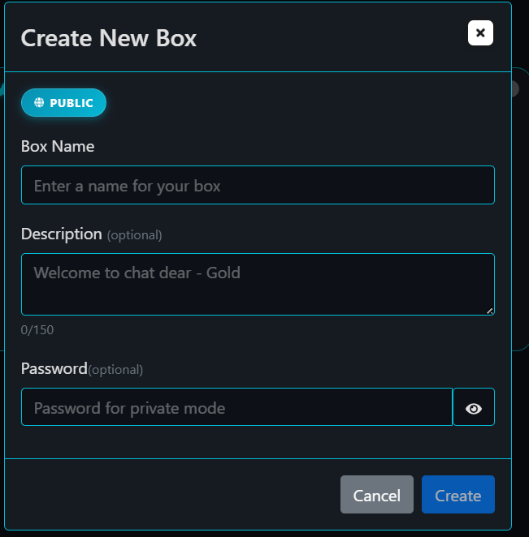
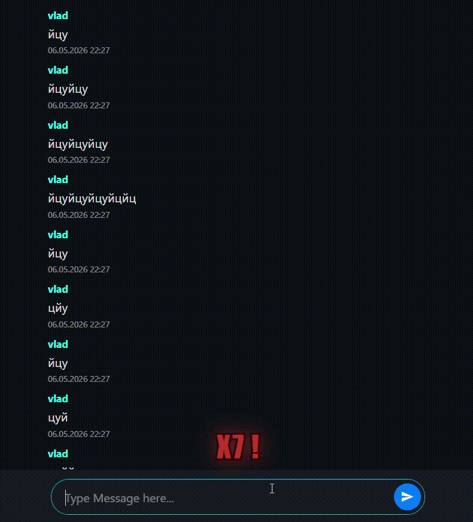

---

#  Defanon-chat — Full-Stack Anonymous Chat Platform

**Defanon-chat** — это интерактивная веб-платформа для анонимного общения в реальном времени, где конфиденциальность пользователей и гибкость управления комнатами («коробками») стоят на первом месте. Проект построен на современной компонентной архитектуре с продвинутой системой сессий, уникальной кастомизацией и встроенными инструментами модерации.

 **Живой фронтенд (Vercel):** https://defanon-chat.vercel.app/
 **Бэкенд API (Render):** https://defanon-chat.onrender.com  

---

## Основные Фичи и Возможности

###  Анонимность и Привязка к Устройству (Device Session Lock)
* **Сессия без паролей:** Для входа достаточно ввести любой никнейм. Все данные авторизации и уникальные ключи безопасности сохраняются строго локально в браузере (`localStorage`).
* **Защита от перехвата ников:** Устройство пользователя жестко привязывается к созданному аккаунту. Если кто-то попытается войти под вашим ником с другого устройства, система заблокирует вход с ошибкой: `This account does not belong to this device or it has been deleted`.
* **Дублирование ников:** Система разрешает создавать аккаунты с одинаковыми именами (например, несколько пользователей с ником "Batman"). Чтобы различать их, приложение генерирует **уникальный цвет никнейма** для каждого пользователя на основе хэша его персонального `UID`. При этом авторизация на одном конкретном устройстве удерживает последнюю активную сессию для данного имени.

###  Кастомизация и Управление «Коробками» (Chatboxes)
* **Создание комнат:** Пользователи могут создавать собственные «коробки» для общения. При создании можно задать имя и кастомное описание. Если описание оставить пустым, подставится дефолтный текст: `Welcome to chat dear - {nickname}`. 
* **Публичный и Приватный режимы:** Комнату можно сделать общедоступной (`PUBLIC`) или защитить паролем (`PRIVATE`), мгновенно превратив её в закрытый чат. Владелец может в любой момент изменить пароль или описание.
* **Идентификация дубликатов:** Если две коробки созданы с одинаковым названием, пользователи всегда могут отличить нужную комнату по её уникальному `UID`, который отображается в карточке информации.
* **Права владельца (Owner Rights):** Создатель коробки получает статус **«Вы владелец»** и полный контроль над настройками комнаты. Удалить коробку может только её создатель.
* **Избранные комнаты:** Нажатием на звездочку на карточке комнаты, она добавляется в список избранного (сохраняется в `localStorage`), после чего к ней можно быстро перейти через верхнее левое меню.

####  Интерфейс управления комнатами:

###  Интерактивный UX и Модерация в Реальном Времени
* **Глобальный поиск:** Удобный поиск по названию через иконку лупы поможет быстро найти коробку, созданную друзьями.
* **Спам-фишка:** При быстрой отправке сообщений подряд на экране активируется динамический комбо-счетчик (анимация `X2`, `X3` ... до `X10`). Максимальный предел спама ограничен 10 сообщениями.
* **Система Мута:** Если пользователь злоупотребляет спамом, владелец коробки может замутить нарушителя на 5 минут, заблокировав ему отправку сообщений, либо закрыть комнату паролем от недоброжелателей.
* **Темы оформления:** Поддержка мгновенного переключения тем (светлая/тёмная) — базово приложение инициализируется в чистом светлом стиле.
* **Плавный интерфейс:** Все ключевые действия (сохранение изменений, удаление, создание комнат) сопровождаются красивыми полупрозрачными анимациями.

####  Демонстрация спам-фишки в чате:

###  Кнопка удаления «Nuke account» (Danger Zone)
В приложении реализована функция полного уничтожения данных с кастомной анимацией закрывающегося глаза. При активации:
1. Фронтенд шлет запрос `DELETE` на изолированный Express-сервер.
2. Бэкенд через скрытый REST API CometChat полностью и безвозвратно выжигает аккаунт пользователя (`UID`) и закрывает доступ.
3. Локальные данные из браузера стираются под ноль, а пользователя разлогинивает.

####  Процесс удаления аккаунта:

---

##  Технологический Стек

**Frontend:**
* **React / Vite** — ультрабыстрая сборка и модульный интерфейс.
* **TypeScript** — строгая типизация для предсказуемости и надежности кода.
* **Redux Toolkit** — централизованный стейт-менеджмент.
* **CometChat SDK** — реализация WebSocket-соединений, комнат и логики чата в реальном времени.

**Backend:**
* **Node.js / Express** — изолированный серверный мост для безопасного взаимодействия с CometChat REST API без утечки ключей на фронтенд.
* **Dotenv** — безопасное управление приватными ключами разработки.
* **CORS** — политика безопасных кросс-доменных запросов.

**Infrastructure / DevOps:**
* **Vercel** — облачный хостинг фронтенд-части.
* **Render** — деплой Node.js бэкенда.
* **Docker** — контейнеризация проекта для быстрой локальной сборки.

---

##  Развёртывание и Локальный запуск (Development)

>  **Примечание:** Если вы хотите просто протестировать чат, использовать ручной запуск не нужно — проект уже развернут в облаке (ссылки в начале документа). Раздел ниже предназначен для разработчиков.

### Вариант 1: Запуск через Docker (Рекомендуемый)
Для автоматического развертывания всей инфраструктуры в изолированных контейнерах выполните в корне проекта:
bash
docker-compose up --build

### Вариант 2: Ручной запуск

1. **Клонируйте репозиторий:**

bash
git clone [https://github.com/WalterGrimes/Defanon-chat.git](https://github.com/WalterGrimes/Defanon-chat.git)
cd Defanon-chat

2. **Настройка Бэкенда (`/server`):**

* Перейдите в папку сервера: `cd server`
* Установите зависимости: `npm install`
* Создайте файл `.env.local` и укажите ваши ключи CometChat:

env
VITE_COMETCHAT_APPID=your_app_id
COMETCHAT_REGION=your_region
VITE_COMETCHAT_APIKEY=your_api_key
PORT=5000

* Запустите сервер: `npm start`

3. **Настройка Фронтенда:**

* Вернитесь в корень / папку фронтенда и установите зависимости: `npm install`
* Настройте локальный `.env` файл для связи с вашим бэкендом (`VITE_API_URL=http://localhost:5000`).
* Запустите режим разработки: `npm run dev`

---

